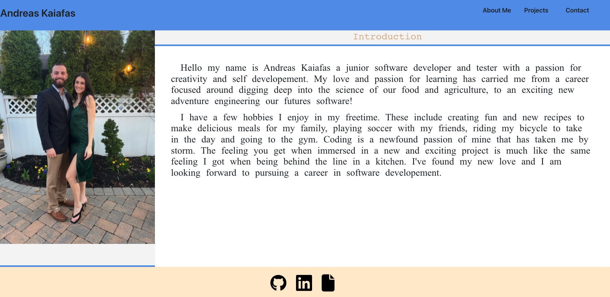

# REACT Portfolio

## Description
A personal Portfolio built with REACT!
## Table of Contents

[Links](#links)

[Media](#media)

[Installation](#installation)

[Usage](#usage)

[GitHub](#github)

[License](#license)

[Questions](#questions)

## Links
[Portfolio Deployed Link](https://react-portfolio-ak.netlify.app/)

## Media
The following image shows the home page: 

## Installation
To install the necessary dependencies, run the following command:

    npm install

## Usage
Install the dependencies with npm install and run the server with npm start.

## GitHub
[Andreas Kaiafas](https://github.com/Akaiafas526)

## License
This product is licensed under MIT.

Copyright (c) 2022 

## Questions
If you have any questions about the repo, open an issue or contact me directly at [Andreas Kaiafas](https://github.com/Akaiafas526)
